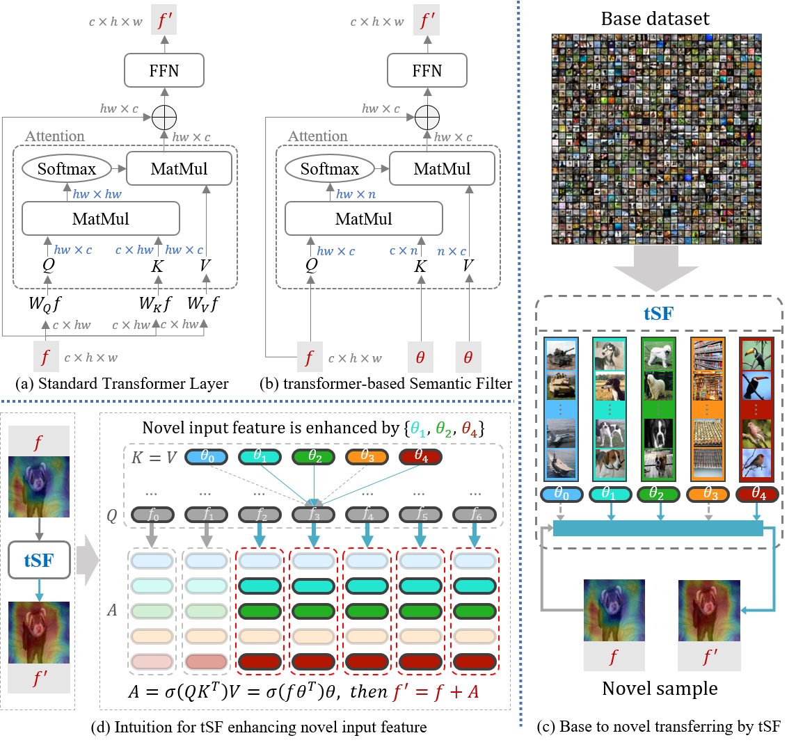

# tSF: Transformer-based Semantic Filter for Few-Shot Learning
This is an official implementation in PyTorch of tSF, which is accepted by ECCV2022.

<p align="center">
  </a>
</p>

## Abstract

Few-Shot Learning (FSL) alleviates the challenge of data shortage via generating task-aware embedding features from plenty seen (base) and few unseen (novel) labeled samples. Most feature embedding blocks in recent FSL methods are specially designed for learning tasks (e.g., classification, segmentation, and object detection), which limits the utility of features. To this end, we propose a light and universal module for FSL tasks, named transformer-based Semantic Filter (tSF), which involves a well-designed transformer-based structure to encode the knowledge from whole base set to novel set and filter semantic features for target category. Furthermore, the parameters of tSF is equal to half of a standard transformer block (less than 1M). In the experiments, our tSF is able to boost the performances in different classic few-shot learning tasks (about 2% improvement), especially outperforms the state-of-the-arts on multiple benchmark datasets (e.g., miniImageNet and tieredImageNet) in few-shot classification task.

<p align="center">
  </a>
</p>

## Repository Overview
The repository is structured as follows:
- args_mini.py/args_tiered.py: Training-related configuration files.
- test_mini_args.py/test_tiered_args.py: Testing-related configuration files.
- train.py: Start training file.
- test.py: Start testing file.
- torchFewShot/: implementation source code.
- doc/: Related documentation.


## Requirements
- Torch >= 1.6.0
- Torchvision >= 0.7.0
- Python == 3.6


## Datasets
Refer to https://github.com/blue-blue272/fewshot-CAN.
<!-- ### mini-Imagenet
For mini-Imagenet experiments, please download mini-Imagenet and put it in ./miniImagenet/data/miniImagenet
and run proc_image.py to preprocess generate train/val/test datasets. (This process method is based on maml).

### tiered-Imagenet
For tiered-Imagenet experiments, please download tiered-Imagenet and put it in ./tieredImagenet/data/
tiered-Imagenet: https://drive.google.com/open?id=1g1aIDy2Ar_MViF2gDXFYDBTR-HYecV07
https://github.com/renmengye/few-shot-ssl-public

```
mkdir -p tieredImagenet/data/tieredImagenet/data
tar -xvf tiered-imagenet.tar
mv *.pkl tieredImagenet/data/tieredImagenet/data
``` -->

## Training
python3 -m torch.distributed.launch --nproc_per_node=4 train.py

## Testing
python3 -m torch.distributed.launch --nproc_per_node=2 test.py


## Citation

If you use this code for your research, please cite our paper:
```
@inproceedings{jinxiang2022tSF,
  title={tSF: Transformer-based Semantic Filter for Few-Shot Learning},
  author={Jinxiang, Lai and Siqian, Yang and Wenlong, Liu and Yi, Zeng and Zhongyi, Huang and Wenlong, Wu and Jun, Liu and Bin-Bin, Gao and Chengjie, Wang},
  booktitle={ECCV},
  year={2022}
}
```

## Acknowledgments

This code is based on the implementations of [**Cross Attention Network for Few-shot Classification**](https://github.com/blue-blue272/fewshot-CAN).
